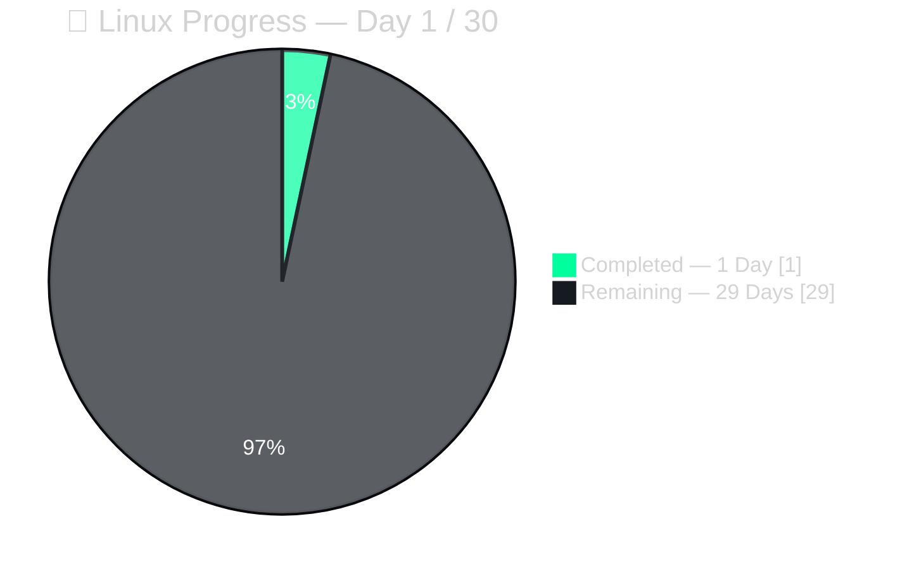
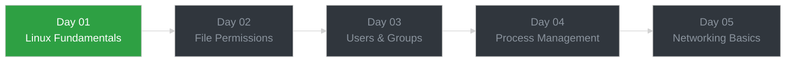
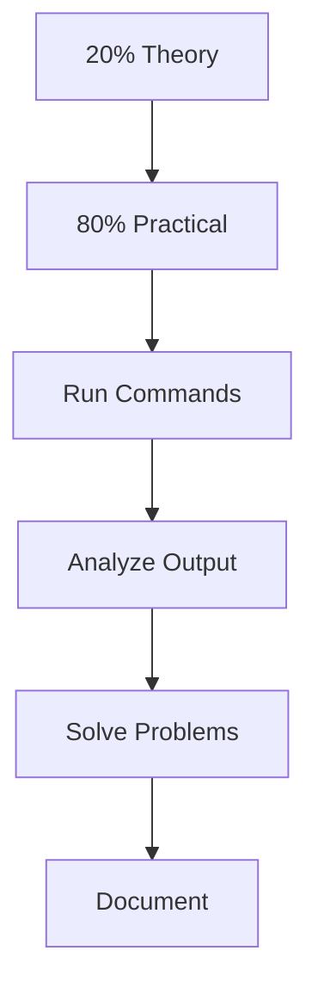
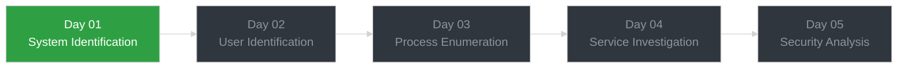

<div align="center">

# 🐧 Linux — Structured Day-by-Day Journal

### ⚡ From Linux Fundamentals → Cyber Security → Penetration Testing

<p>
  <strong>🧠 Learn</strong> → 
  <strong>💻 Practice</strong> → 
  <strong>🔍 Analyze</strong> → 
  <strong>🛠️ Troubleshoot</strong> → 
  <strong>🔐 Secure</strong> → 
  <strong>📝 Document</strong>
</p>

<p>
  <em>“Don't just learn commands. Understand what happens when you run them.”</em>
</p>

<br>


<br><br>

> **🎯 Practical-first Linux learning journey focused on Cyber Security & Penetration Testing.**
>
> **Every day = Real Commands + Real Output + Hands-on Tasks + Challenges + Troubleshooting + Lessons Learned**

</div>

---
## 📊 Progress Dashboard



**Overall completion:**

[█░░░░░░░░░░░░░░░░░░░░░░░░░░░] 3%

| Metric                 |           Value |
| ---------------------- | --------------: |
| 📅 Days Completed      |      **1 / 30** |
| 🎯 Current Day         |      **Day 01** |
| 🧩 Challenges Assigned |           **1** |
| 🧩 Challenges Solved   |           **0** |
| 🔥 Current Streak      |       **1 Day** |
| 🧪 Practical Focus     |         **80%** |
| 📚 Theory Focus        |         **20%** |
| 🚦 Status              | **In Progress** |

---


## 🗺️ Learning Flow



---


## 🎯 How This Journal Works




Every day focuses on four things:
| Section                  | What I document                      |
| ------------------------ | ------------------------------------ |
| ⚡ **Quick Theory**       | Only the minimum concept required    |
| 💻 **Hands-On Practice** | Commands I actually run              |
| 🎯 **Mini Challenge**    | Practical problem to solve           |
| 🐛 **Errors / Gotchas**  | Mistakes, errors and troubleshooting |


### This journal is NOT:

- ❌ Copy-pasted theory
- ❌ Commands I haven't actually tested
- ❌ A collection of definitions
- ❌ A textbook

### This journal IS:

- ✅ Hands-on practice
- ✅ Real terminal output
- ✅ Troubleshooting
- ✅ Practical challenges
- ✅ Security-focused learning
---

## 📅 Day-by-Day Index

| Day             | Topic                                  | Status     |
| --------------- | -------------------------------------- | ---------- |
| [01](./Day-01/) | Linux Fundamentals & System Inspection | ✅ Done     |
| 02              | File Permissions & Ownership           | 🔜 Next    |
| 03              | Users & Groups                         | ⏳ Upcoming |
| 04              | Process & Service Management           | ⏳ Upcoming |
| 05              | Networking Basics                      | ⏳ Upcoming |


---

## 🧩 Day 01 Snapshot — Linux Fundamentals

> **Quick Theory:**
Linux = Kernel + Shell + Distro. Kernel talks to hardware, Shell is how I talk to the Kernel. That's it — rest is muscle memory from practice.

**Hands-On Practice:**
```bash
# System Information

uname -a                    # kernel & system information
cat /etc/os-release         # OS & distribution information
hostname                    # system hostname
hostnamectl                # OS, kernel & hostname details


# User & Identity

whoami                      # current logged-in user
id                          # user ID, group ID & group membership


# Process & Resource Monitoring

ps aux                     # list all running processes
ps aux | grep <process>     # search for a specific process
top                        # live process & resource usage
free -h                     # memory usage in human-readable format


# Filesystem Navigation

pwd                        # show current working directory
ls                         # list files & directories
ls -la                     # detailed listing including hidden files
cd <directory>             # change directory


# File & Directory Operations

mkdir <directory>          # create a directory
touch <file>               # create an empty file
echo "<text>"              # print text to the terminal
cat <file>                 # display file contents
```

## 🔎 Practical Work
- Identified the Linux kernel and OS information
- Checked hostname and current user
- Inspected user ID and groups
- Viewed running processes
- Searched for specific processes
- Monitored system resources
- Navigated the Linux filesystem
- Created and inspected files/directories
- Practiced basic input/output redirection
---
## 🔐 Security Connection
> These commands are basic building blocks for:



---


## 🏆 30-Day Progress Goals

```mermaid
%%{init: {'theme':'dark'}}%%
gantt
    title 30-Day Linux Learning Roadmap
    dateFormat X
    axisFormat %s

    section Fundamentals
    Linux Fundamentals       :done, d1, 0, 1d
    File Permissions         :active, d2, 1, 1d
    Users & Groups           :d3, 2, 1d

    section System Management
    Process Management       :d4, 3, 1d
    Networking Basics        :d5, 4, 1d
    Services & Systemctl     :d6, 5, 1d

    section Security
    Logs & Log Analysis      :d7, 6, 1d
    Linux Security           :d8, 7, 1d
```



## Current Milestones
- Day 01 — Linux Fundamentals
- Day 02 — File Permissions & Ownership
- Day 03 — Users & Groups
- Day 04 — Process Management
- Day 05 — Networking Basics
- Linux Administration Fundamentals
- Security-focused Linux Practice
- Complete 30-Day Linux Journey
---

## 🛠️ Skills Being Built
Linux

```text
Filesystem       ████████░░  Strong Foundation
File Management  ██████░░░░  Developing
Permissions      ███░░░░░░░  Upcoming
Users & Groups   ██░░░░░░░░  Upcoming
Processes        ███░░░░░░░  Developing
Services         ██░░░░░░░░  Upcoming
Networking       ██░░░░░░░  Upcoming
Bash             ██░░░░░░░░  Upcoming
```
> Skill indicators will be updated based on practical exposure, not just theory.
---

## 🧪 Practical Workflow
> For every important command or task, I try to follow:

```text
💻 Run Command
      ↓
📤 Observe Output
      ↓
🧠 Understand Result
      ↓
🐛 Investigate Errors
      ↓
🔧 Troubleshoot
      ↓
🔐 Connect With Security
      ↓
📝 Document

```
---

## 🔐 Cyber Security Connection
> Linux is one of the foundations of my broader Cyber Security and Penetration Testing journey.
```text
🐧 Linux
   ↓
🌐 Networking
   ↓
🔎 Enumeration
   ↓
🛠️ Security Tools
   ↓
🌐 Web Security
   ↓
🧪 Penetration Testing

```
> The objective is to understand the system first and then apply that knowledge to security testing.
bash
---


## 📂 Repository Structure
```text
linux-learning-journey/
│
├── README.md
│
├── Day-01/
│   └── README.md
│
├── Day-02/
│   └── README.md
│
├── Day-03/
│   └── README.md
│
├── Day-04/
│   └── README.md
│
└── ...

Each day may contain:
```

```text
🎯 Objective
⚡ Quick Theory
💻 Commands
📤 Real Output
🧪 Hands-On Tasks
🎯 Mini Challenge
🐛 Errors / Gotchas
🔐 Security Relevance
🧠 What I Learned
```
---


## 📈 Learning Philosophy
> Don't just memorize the command. Understand the output.
> For every command, I want to understand:
```text
What does it do?
      ↓
Why do I use it?
      ↓
What does the output mean?
      ↓
What can go wrong?
      ↓
Where can it be useful in Cyber Security?
```
---

## 🚀 Long-Term Goal

Build a strong practical foundation in:
```text
🐧 Linux
🌐 Networking
🐚 Bash Scripting
🔎 Enumeration
🔐 Security Fundamentals
🧪 Penetration Testing
```
> The long-term goal is to apply these fundamentals to real-world security labs and penetration testing environments.
---


## 🔥 Current Status
Linux Learning Journey
```text
Day 01 / 30

████████████████████████████████████████

Started → Practicing → Documenting → Improving

```
<p align="center">
🐧 Learn • 💻 Practice • 🐛 Troubleshoot • 🔐 Secure

Building practical Linux skills one day at a time.

</p> 

---

<p align="center">

### 🐧 Keep Learning. Keep Breaking. Keep Understanding.

**Learn → Practice → Troubleshoot → Master**

*"The terminal doesn't care how much theory you know. It shows what you can actually do."*

</p>

---

<p align="center">
  <sub>Linux Learning Journey   • Cyber Security • Hands-On Practice   • Continuous Improvement</sub>
</p>

---
