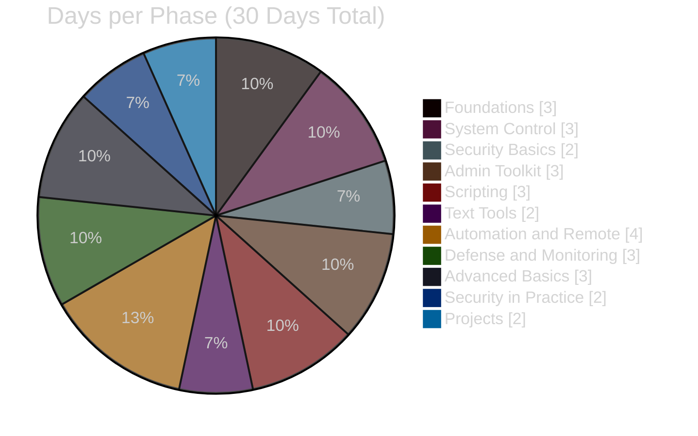
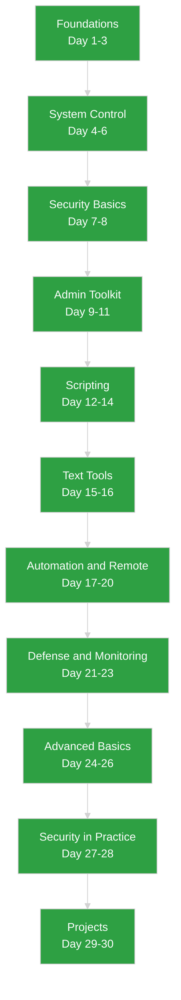

# 🐧 Linux — Structured Day-by-Day Journal

> **Practical-first Linux learning journey focused on Cyber Security & Penetration Testing.**
>
> Every day = real commands, real output, hands-on tasks, challenges, mistakes and lessons learned.

<p align="center">
  
  
  
  
</p>

---

## 📊 Progress Dashboard


```mermaid
%%{init: {'theme':'dark'}}%%
pie showData
    title Days per Phase (30 Days Total)
    "Foundations" : 3
    "System Control" : 3
    "Security Basics" : 2
    "Admin Toolkit" : 3
    "Scripting" : 3
    "Text Tools" : 2
    "Automation and Remote" : 4
    "Defense and Monitoring" : 3
    "Advanced Basics" : 3
    "Security in Practice" : 2
    "Projects" : 2
```

**Overall completion:**

`[██████████████████████████████] 100%`

| Metric                 |            Value |
| ----------------------- | ----------------: |
| 📅 Days Completed      |     **30 / 30** |
| 🎯 Current Day         |      **Day 30** |
| 🧩 Challenges Assigned |          **90** |
| 🛠️ Projects Built      |           **2** |
| 🧪 Practical Focus     |         **80%** |
| 📚 Theory Focus        |         **20%** |
| 🚦 Status              | **Complete** |

---

## 🗺️ Learning Flow


```mermaid
%%{init: {'theme':'dark'}}%%
flowchart TD
    A[Foundations<br/>Day 1-3] --> B[System Control<br/>Day 4-6]
    B --> C[Security Basics<br/>Day 7-8]
    C --> D[Admin Toolkit<br/>Day 9-11]
    D --> E[Scripting<br/>Day 12-14]
    E --> F[Text Tools<br/>Day 15-16]
    F --> G[Automation and Remote<br/>Day 17-20]
    G --> H[Defense and Monitoring<br/>Day 21-23]
    H --> I[Advanced Basics<br/>Day 24-26]
    I --> J[Security in Practice<br/>Day 27-28]
    J --> K[Projects<br/>Day 29-30]

    style A fill:#2ea043,color:#fff
    style B fill:#2ea043,color:#fff
    style C fill:#2ea043,color:#fff
    style D fill:#2ea043,color:#fff
    style E fill:#2ea043,color:#fff
    style F fill:#2ea043,color:#fff
    style G fill:#2ea043,color:#fff
    style H fill:#2ea043,color:#fff
    style I fill:#2ea043,color:#fff
    style J fill:#2ea043,color:#fff
    style K fill:#2ea043,color:#fff
```

---

## 🎯 How This Journal Works

Every day follows the same structure. Theory is kept to a bare minimum, practice takes up 80% of the space.

```text
20% Theory
    ↓
80% Practical
    ↓
Run Commands
    ↓
Analyze Output
    ↓
Solve Problems
    ↓
Document
```

| Section                  | What I document                      |
| ------------------------ | ------------------------------------ |
| ⚡ **Quick Theory**       | Only the minimum concept required    |
| 💻 **Hands-On Practice** | Commands I actually run              |
| 🎯 **Mini Challenges**   | Practical problems to solve          |
| 🐛 **Errors / Gotchas**  | Mistakes, errors and troubleshooting |

**This journal is NOT:**
- ❌ Copy-pasted theory
- ❌ Commands I haven't actually tested
- ❌ A collection of definitions
- ❌ A textbook

**This journal IS:**
- ✅ Hands-on practice
- ✅ Real terminal output
- ✅ Troubleshooting
- ✅ Practical challenges
- ✅ Security-focused learning

---

## 📅 Day-by-Day Index

| Day | Topic | Status |
| --- | ----- | ------ |
| [01](./Day-01/) | Linux Fundamentals & System Inspection | ✅ Done |
| [02](./Day-02/) | File Permissions & Ownership | ✅ Done |
| [03](./Day-03/) | Users & Groups Management | ✅ Done |
| [04](./Day-04/) | Process Management | ✅ Done |
| [05](./Day-05/) | Networking Basics | ✅ Done |
| [06](./Day-06/) | Services & Systemctl | ✅ Done |
| [07](./Day-07/) | Logs & Log Analysis | ✅ Done |
| [08](./Day-08/) | Linux Security Basics (SUID/SGID) | ✅ Done |
| [09](./Day-09/) | Package Management | ✅ Done |
| [10](./Day-10/) | Disk & Storage Management | ✅ Done |
| [11](./Day-11/) | Archiving & Compression | ✅ Done |
| [12](./Day-12/) | Shell Scripting Basics | ✅ Done |
| [13](./Day-13/) | Shell Scripting: Loops & Functions | ✅ Done |
| [14](./Day-14/) | Environment Variables & Shell Config | ✅ Done |
| [15](./Day-15/) | Text Processing: grep & sed | ✅ Done |
| [16](./Day-16/) | Text Processing: awk & Advanced grep | ✅ Done |
| [17](./Day-17/) | Cron Jobs & Task Scheduling | ✅ Done |
| [18](./Day-18/) | SSH & Remote Access | ✅ Done |
| [19](./Day-19/) | SSH Key-Based Authentication | ✅ Done |
| [20](./Day-20/) | File Transfer: scp & rsync | ✅ Done |
| [21](./Day-21/) | Firewall Basics (ufw) | ✅ Done |
| [22](./Day-22/) | System Monitoring (top, htop, vmstat) | ✅ Done |
| [23](./Day-23/) | Disk I/O & Performance Basics | ✅ Done |
| [24](./Day-24/) | Symbolic & Hard Links | ✅ Done |
| [25](./Day-25/) | Finding Files: find & locate | ✅ Done |
| [26](./Day-26/) | Regular Expressions in Linux | ✅ Done |
| [27](./Day-27/) | Basic Linux Hardening Checklist | ✅ Done |
| [28](./Day-28/) | Log Analysis for Security | ✅ Done |
| [29](./Day-29/) | Mini Project: System Health Dashboard Script | ✅ Done |
| [30](./Day-30/) | Final Project: Automated Backup Script + Wrap-Up | ✅ Done |

---

## 🧭 Phase Overview

| Phase | Days | What I covered |
| ----- | ---- | -------------- |
| **Foundations** | 01-03 | Linux basics, filesystem, permissions, users and groups |
| **System Control** | 04-06 | Processes, networking basics, services and systemctl |
| **Security Basics** | 07-08 | Log reading, SUID/SGID and hardening basics |
| **Admin Toolkit** | 09-11 | Package management, disk and storage, archiving |
| **Scripting** | 12-14 | Variables, if/else, loops, functions, shell config |
| **Text Tools** | 15-16 | grep, sed, awk |
| **Automation and Remote** | 17-20 | Cron, SSH, SSH keys, scp and rsync |
| **Defense and Monitoring** | 21-23 | Firewall (ufw), top/htop/vmstat, disk I/O |
| **Advanced Basics** | 24-26 | Links, find and locate, regular expressions |
| **Security in Practice** | 27-28 | Hardening checklist, log analysis for security |
| **Projects** | 29-30 | Health dashboard script, automated backup script |

---

## 🛠️ Projects Built

| Project | What it does | Folder |
| ------- | ------------ | ------ |
| **System Health Dashboard** | One-run report: system info, memory, disk, top processes, network, security checks | [Day-29](./Day-29/) |
| **Automated Backup Script** | Creates a compressed backup, verifies it, logs every step, deletes old backups | [Day-30](./Day-30/) |

---

## 🏆 Milestones

- [x] Phase 1: Foundations (Day 01-03)
- [x] Phase 2: System Control (Day 04-06)
- [x] Phase 3: Security Basics (Day 07-08)
- [x] Phase 4: Admin Toolkit (Day 09-11)
- [x] Phase 5: Scripting (Day 12-14)
- [x] Phase 6: Text Tools (Day 15-16)
- [x] Phase 7: Automation and Remote (Day 17-20)
- [x] Phase 8: Defense and Monitoring (Day 21-23)
- [x] Phase 9: Advanced Basics (Day 24-26)
- [x] Phase 10: Security in Practice (Day 27-28)
- [x] Phase 11: Projects (Day 29-30)
- [x] Complete 30-Day Linux Journey

---

## 🛠️ Skills Built

```text
Linux

Command Line          ██████████  Solid
Filesystem            ██████████  Solid
Permissions           █████████░  Solid
Users & Groups        █████████░  Solid
Processes & Services  ████████░░  Good
Networking Basics     ████████░░  Good
Shell Scripting       ████████░░  Good
Text Processing       ████████░░  Good
SSH & Remote Access   ████████░░  Good
Security Basics       ███████░░░  Good
```
*Skill indicators reflect practical exposure, not just theory. Update them honestly as you keep practicing.*

---

## 🧪 Practical Workflow

```text
💻 Run Command
      ↓
📤 Observe Output
      ↓
🧠 Understand Result
      ↓
🐛 Investigate Errors
      ↓
🔧 Troubleshoot
      ↓
🔐 Connect With Security
      ↓
📝 Document
```

---

## 🔐 Cyber Security Connection

Linux is one of the foundations of my broader Cyber Security and Penetration Testing journey.

```text
🐧 Linux  ✅ (this journal)
   ↓
🌐 Networking
   ↓
🔎 Enumeration
   ↓
🛠️ Security Tools
   ↓
🌐 Web Security
   ↓
🧪 Penetration Testing
```
The objective is to understand the system first and then apply that knowledge to security testing.

---

## 📂 Repository Structure

```text
linux-learning-journey/
│
├── README.md
│
├── Day-01/
│   ├── README.md
│   ├── commands.txt
│   ├── notes.txt
│   └── screenshots/
│
├── Day-02/  ...  Day-28/      (same structure in every day)
│
├── Day-29/
│   ├── README.md
│   ├── health_dashboard.sh
│   ├── commands.txt
│   ├── notes.txt
│   └── screenshots/
│
└── Day-30/
    ├── README.md
    ├── backup.sh
    ├── commands.txt
    ├── notes.txt
    └── screenshots/
```

Each day contains:
- 🎯 Objective and quick theory
- 💻 Commands with real output
- 🧪 Hands-on tasks
- 🎯 Mini challenges (solutions in the next day's README)
- 🧩 Quick quiz
- 🐛 Errors / gotchas
- 🧠 Takeaway

---

## 📈 Learning Philosophy

Don't just memorize the command. Understand the output.

```text
What does it do?
      ↓
Why do I use it?
      ↓
What does the output mean?
      ↓
What can go wrong?
      ↓
Where can it be useful in Cyber Security?
```

---

## 🚀 What's Next

Linux fundamentals are done. Next phase: hands-on tools, same rule as this journal (run it myself first, then document it).

- 🌐 Networking tools
- 🐧 Linux / sysadmin tools
- 🔐 Cybersecurity / pentesting tools
- ☁️ Cloud / DevOps tools
- 🔧 Advanced Git

---

## 🔥 Current Status

**Linux Learning Journey: Day 30 / 30 ✅ COMPLETE**

`[██████████████████████████████████████████]`

Started → Practiced → Documented → Improved → **Finished**

<p align="center">

🐧 Learn • 💻 Practice • 🐛 Troubleshoot • 🔐 Secure

30 days. 30 topics. One habit built.

</p>
